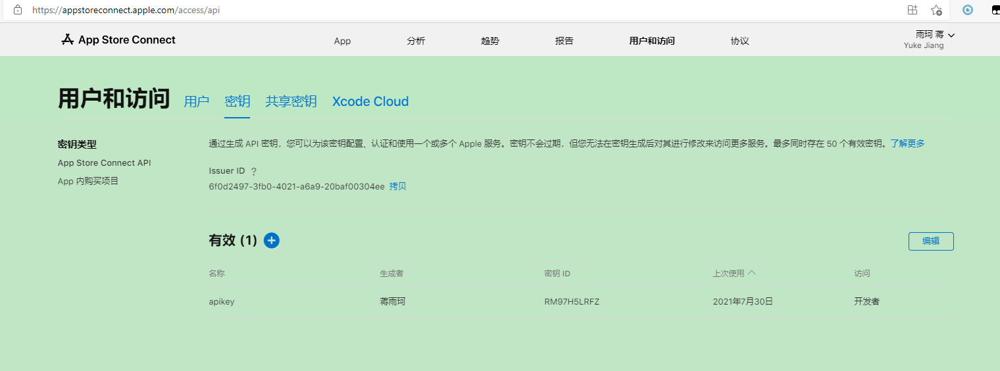
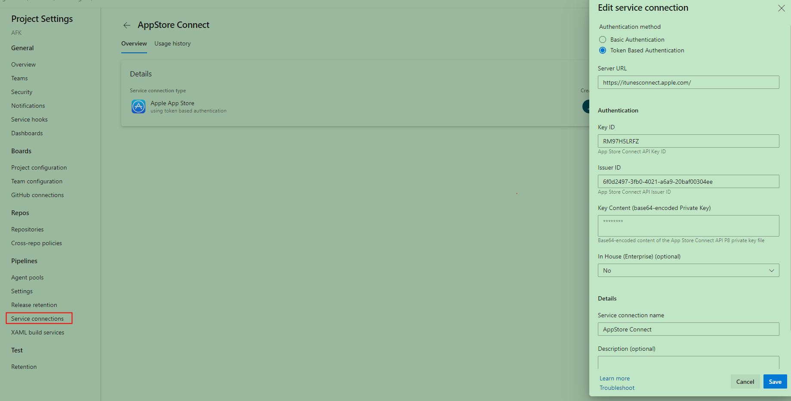
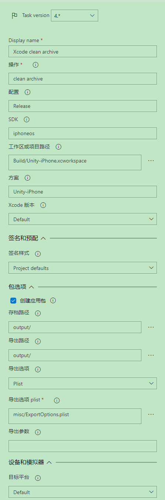
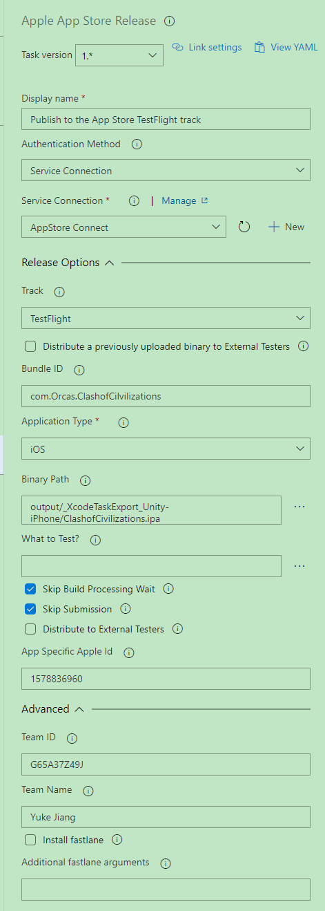

# 自动打包文档

# 安卓

## Step 1 确认Unity版本 
1.确认工程使用的unity版本在打包机上面已经安装了（版本需要和unityversion文件里面的完全一致，记得勾选安装ios和android环境！！)  
2.确认安卓打包gradle中配置的build tool version的版本和unity默认配置一致。  
3.如未安装使用TightVNC viewer自行远程链接到打包机进行安装  
    
    ip:172.17.2.174  
    密码:qwer@123  
    电脑用户密码:qwer@123  
    注意安装目录要在Application/Unity/Hub/Editor/ 下（最好直接使用hub下载，目录自动就是正确目录）
    
注意：长时间不用远程链接的时候最好直接关掉链接，发现一个已知问题，远程链接过去长时间不动会导致打包机屏保弹出来，而且这个屏保还关不掉。目前没找到解决方法。

## step2 确认项目本身可以构建
1.项目工程可以在本地通过引擎的打包工具流程进行打包。

## Step 3 创建管道和配置管道(安卓版）
1.在项目tfs页面找到Pipeline管道菜单。(https://tfs.fotoable.com/tfs/game2/项目名称/_build)

2.依次点击“新建管道”->"使用经典编辑器"->“继续”->"空作业"。或直接导入[AFK项目的安卓管道](./安卓管道设置模板.json)后修改。
	
3.管道创建好过后单机"管道"选项卡，代理池下拉菜单选中MacMini。
	
4.获取源选项卡中可以选择想要打包的分支，（可选配置：勾选浅提取，深度填1.）
	
5.点击加号创建代理作业，搜索框输入"unity"，选择“unity command”，作业名称改为"打AB"，command line arguments一栏中填入{-buildTarget Android -executeMethod ProjectBuildHelper.BuildAB ***工程里面AB打包设置文件的名字*** -quit}(别把花括号一起填进去了,后面文档中的花括号都别复制)
	
6.用同样的方法创建名称为"拷贝streamingassets"的作业,填入{-buildTarget Android -executeMethod ProjectBuildHelper.CopyAB2StreamingAssets ***工程里面打包设置文件的名字*** -quit}
	
7.创建名为"导出APK"的作业，填入{-buildTarget Android -executeMethod ProjectBuildHelper.BuildAPK ***{KEYSTORE_PASSWORD}***  ***{KEYSTORE_ALIAS_NAME}*** ***{KEYSTORE_ALIAS_PASSWORD}*** -quit} 如果需要build aab包则应该调用BuildAAB而非BuildAPK
	
8.钉钉创建机器人，头像左键->设置->机器人管理->自定义->勾上加签和ip地址，ip地址填
	{171.223.209.153}。创建完成。
	
9.然后在上面的管道处创建发送apk到钉钉的作业（注意，这个时候使用 命令行作业(cmd)，不是unity的command line！）脚本一栏填入：{python3 /Users/btkj/Desktop/myagent/_work/SendApkToDingTalk.py ***机器人的webhook*** ***机器人签名密钥***}
	
10.保存运行即可，如需配置定时任务可以自行配置"触发器"。如果需要代码一更新就自动打包的话可以在触发器里面勾上持续集成。
### hint：可以参考AFK项目的管道配置比对进行设置。
## 注意！ 第一次打包的时候如果发现卡在build apk这一个步骤，需要远程链接到打包机上面看一下是不是java文件访问权限的问题，这个需要手动点一下同意！

# iOS
## Step 1 准备
1. 准备好ios打包用的证书(p12)和描述文件。（第一次配都统一用distribution的，后面玩懂了自己爱怎么搞怎么搞）
2. 在苹果后台创建好项目。
3. 在苹果后台创建apikey,并下载下来保存好。
    
## Step 2 确认项目相关配置正确
1. 确认工程使用的unity版本在打包机上面已经安装了（版本需要和unityversion文件里面的完全一致，记得勾选安装ios和android环境！！)  
2. 确认项目可以正常导出Xcode工程，并打包。  
3. 项目设置：

    Player Setting中正确添加Default Icon
    Player Setting的other stetting中的Team ID和profile ID需要正确配置，
    Profile Type选Distribution, 取消勾选AutomaticSigning(这两个设置我在打包的代码里面自动进行了，不过配置最好也还是这么配)
4. 在项目misc文件下创建文件[ExportOptions.plist](ExportOptions.plist),参考该模板，对里面参数值进行修改。
## Step 3 配置管道
1. 配置Service Connections。在tfs平台项目设置里面选中Service Connections选单->新建。配置参考：
        
    注意，在step 1中准备的apikey的私钥需要经过base64后填入key content框里面。
2. 依次点击“新建管道”->"使用经典编辑器"->“继续”->"空作业"。或直接导入[AFK项目的IOS管道](Ios管道设置模板.json)后修改。
3. 管道创建好过后单机"管道"选项卡，代理池下拉菜单选中MacMini。
4. 获取源选项卡中可以选择想要打包的分支。
5. 点击加号创建代理作业，搜索框输入"apple",选择"安装 apple 预配配置文件",上传profile文件。
6. 点击加号创建代理作业，搜索框输入"apple",选择"安装Apple证书",上传p12文件。密钥链选Temp,并填入正确的签名标识。
7. 点击加号创建代理作业，搜索框输入"unity"，选择“unity command”，作业名称改为"打AB"，command line arguments一栏中填入{-buildTarget iOS -executeMethod ProjectBuildHelper.BuildAB ***工程里面AB打包设置文件的名字*** -quit}(别把花括号一起填进去了,后面文档中的花括号都别复制)
8. 用同样的方法创建名称为"拷贝streamingassets"的作业,填入{-buildTarget iOS -executeMethod ProjectBuildHelper.CopyAB2StreamingAssets ***工程里面打包设置文件的名字*** -quit}
9. 创建名为"导出Xcode"的作业，填入{-buildTarget iOS -executeMethod ProjectBuildHelper.BuildXCode -quit} 注意在高级选项卡里面关掉 xcpretty
10. 点击加号创建代理作业，搜索框输入"xcode",选择"XCode", 配置如下图
     
11. 点击加号创建代理作业，搜索框输入"Apple",选择"Apple App Store Release", 配置如下图
    
    
    需要注意的是BinaryPath选项中的ipa名字需要修改。
12. 配置完毕，运行进行测试。

Hint: 这里有个小技巧，测试的时候如果想要去掉一些不必要的流程可以把作业的control options修改一下，将运行条件改成自定义条件，公式填入eq(1,2),这样就能跳过相应作业。